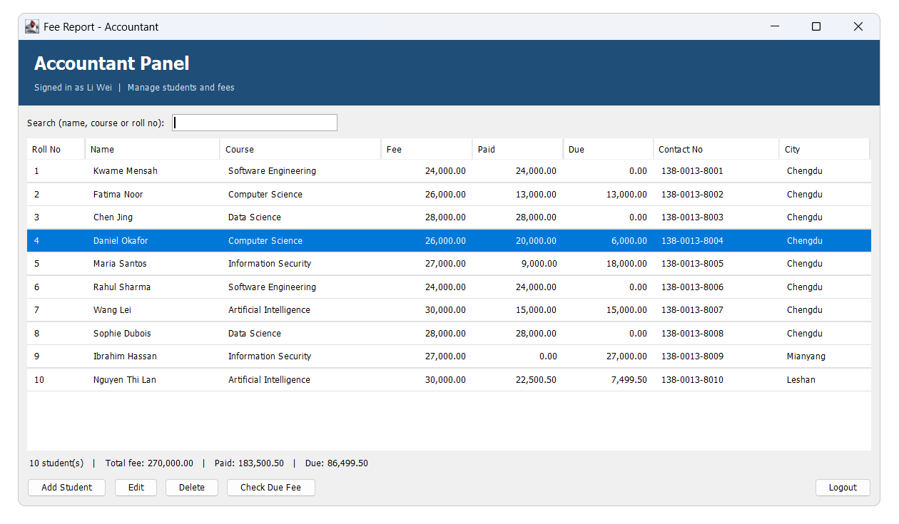
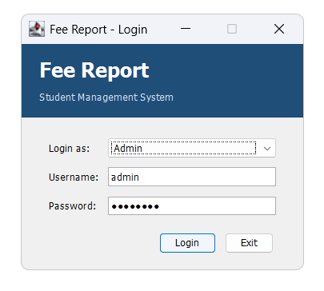
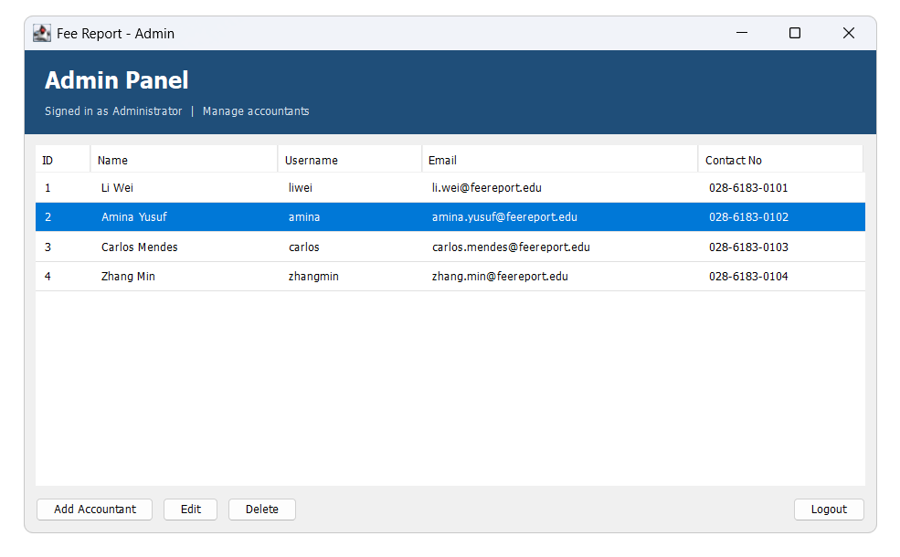
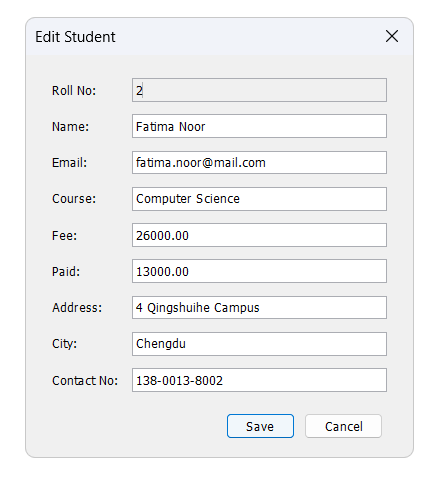
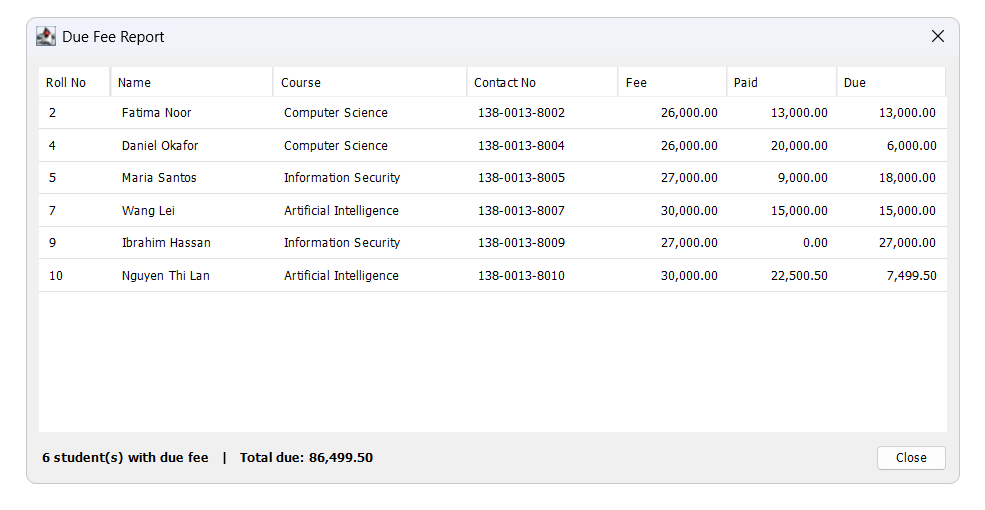
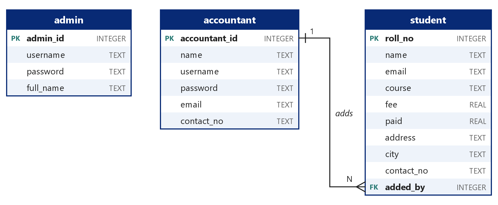

# Fee Report

A desktop student management system for the accounts office of an institute. An admin
manages the accountants; accountants manage the students, record fee payments and see
at a glance who still owes money.

Built with Java Swing and SQLite. It runs from a single jar, with no database server to
install.



## Features

**Admin**

- Add, view, edit and delete accountants
- Usernames are unique; every field is validated before it is saved

**Accountant**

- Add, view, edit and delete students
- Search as you type by name, course or roll number
- Running totals of fee, paid and due amounts under the table
- Due fee report listing every student who has not paid in full

**General**

- Separate logins for the two roles, with logout back to the login window
- Passwords are stored as salted PBKDF2 hashes, never as plain text
- All SQL goes through prepared statements
- Data is kept in one SQLite file next to the program

## Screenshots

| Login | Admin panel |
|-------|-------------|
|  |  |

| Student form | Due fee report |
|--------------|----------------|
|  |  |

## Getting started

### Requirements

- Java 8 or newer to run the program
- A JDK (8 or newer) to build it from source

### Download

The [latest release](https://github.com/billy001-11/fee-report/releases/latest) has a
ready-to-run zip. Unzip it and double-click `run.bat`.

### Build and run

On Windows:

```bat
build.bat
run.bat
```

`build.bat` compiles the sources and packs `FeeReport.jar`. `run.bat` starts it. On any
other system, the same two steps are:

```sh
mkdir -p out
javac -source 8 -target 8 -encoding UTF-8 -cp "lib/*" -d out src/feereport/*.java
jar cfm FeeReport.jar manifest.txt -C out .
java -jar FeeReport.jar
```

### First login

The first start creates `feereport.db` in the program folder with one admin account:

| Role  | Username | Password   |
|-------|----------|------------|
| Admin | `admin`  | `admin123` |

Log in as the admin, add an accountant, log out, then log in as that accountant to work
with students. Delete `feereport.db` to start again with an empty database.

## Project structure

```
src/feereport/
  Main.java               Entry point
  Database.java           Connection, table creation, default admin
  PasswordUtil.java       Password hashing and verification
  Accountant.java         Data class
  Student.java            Data class
  AdminDao.java           SQL for the admin table
  AccountantDao.java      SQL for the accountant table
  StudentDao.java         SQL for the student table
  LoginFrame.java         Login window
  AdminFrame.java         Admin window
  AccountantDialog.java   Add / edit accountant form
  AccountantFrame.java    Accountant window
  StudentDialog.java      Add / edit student form
  DueFeeDialog.java       Due fee report
  Ui.java                 Shared helpers for the windows
test/feereport/
  DataLayerTest.java      Checks for the database layer
lib/                      SQLite JDBC driver
docs/                     Screenshots and the ER diagram
```

The code is split into three layers: data classes, DAO classes that hold all SQL, and
Swing windows that call the DAOs.

## Database



Three tables: `admin`, `accountant` and `student`. Each student row records the
accountant who added it (`added_by`); deleting an accountant keeps the students and
clears that reference. The due fee is not stored. It is always calculated as
`fee - paid`.

## Tests

```bat
test.bat
```

This compiles the program together with `DataLayerTest` and runs 25 checks against a
temporary database: table creation, both logins, accountant and student operations,
search and the due fee calculation. The same checks run on every push through GitHub
Actions, on Java 8 and Java 21.

## Open in an IDE

Open the folder in IntelliJ IDEA, Eclipse or NetBeans, mark `src` as the source folder
and add `lib/sqlite-jdbc-3.53.4.0.jar` to the class path. The main class is
`feereport.Main`.

## Limitations

- A payment is recorded by editing the paid amount; there is no payment history.
- The admin password cannot be changed from inside the program.
- The database is a local file, so it is meant for one computer at a time.

## Third-party software

The `lib` folder contains [sqlite-jdbc](https://github.com/xerial/sqlite-jdbc)
3.53.4.0, distributed under the Apache License 2.0.

## License

Released under the [MIT License](LICENSE).
